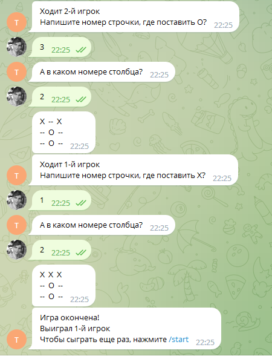

# Описание работы программы

Телеграм-бот nolic_bot позволяет двум игрокам играть в игру крестики-нолики на квадратном поле любой размерности. 

Игроки ходят по очереди. Для хода необходимо указать в какой строке и в каком столбце игрок хочет походить. 

Как только будет сформирована победная комбинация из крестиков или из ноликов, бот сообщит о победе игрока.

# Бот поддерживает команды:
/start - начало работы и приглашение ввести выражение для рассчета

/help - описание какие операции может осуществлять бот

/change_size n - вместо n указывается целое число и поле для игры устанавливается как n x n

# Вид бота во время игры

